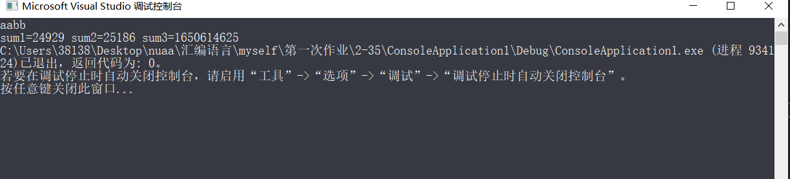

## <center>汇编作业（一）</center>
### <center>161730123-刘志赞</center>
#### <center>2019.10.3</center>
#### 1、P58,35题，输入四个字符输出两个字数据的值和一个双字数字的值
##### 思路：
简单的寄存器使用即可，为了得到双字数据，先将AX左移16位，然后把BX传送到AX,这样得到的EAX便是双字节数据.
注意是小端法
##### 代码：
```c
#include "pch.h"
#include <stdio.h>

int main()
{
	char a, b, c, d;
	unsigned short e, f;
	unsigned int g;
	scanf("%c %c %c %c", &a, &b,&c,&d);
	_asm {
		MOV AH, b
		MOV AL,a
		MOV e,AX
		MOV BH,d
		MOV BL,c
		MOV f,BX

		SAL EBX,16
		MOV BX,AX
		MOV g, EBX
	}
	//printf("sum1=%d", e);
	printf("sum1=%d sum2=%d sum3=%d", e,f,g);
	return 0;
}
```
##### 运行结果：
