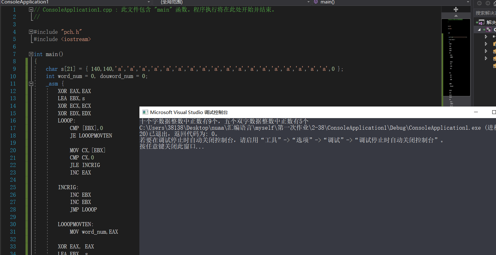

## <center>汇编作业（一）</center>
### <center>161730123-刘志赞</center>
#### <center>2019.10.3</center>
#### 1、P58,38题，20个数据求连续多少个正字数据，多少个正双字数据
##### 思路：
通过循环即可
##### 代码：
```c

#include "pch.h"
#include <iostream>

int main()
{
	char s[21] = { 140,140,'a','a','a','a','a','a','a','a','a','a','a','a','a','a','a','a','a','a',0 };
	int word_num = 0, douword_num = 0;
	_asm {
		XOR EAX,EAX
		LEA EBX,s
		XOR ECX,ECX
		XOR EDX,EDX
		LOOOP:
			CMP [EBX],0
			JE LOOOPMOVTEN
            
			MOV CX,[EBX]
			CMP CX,0
            JLE INCRIG
			INC EAX

		INCRIG:
			INC EBX
			INC EBX
			JMP LOOOP

		LOOOPMOVTEN:
			MOV word_num,EAX

		XOR EAX, EAX
		LEA EBX, s
		XOR ECX, ECX
		XOR EDX, EDX
		LOOOP1:
			CMP [EBX], 0
			JE LOOOPMOVFIVE
			MOV ECX, [EBX]
			CMP ECX, 0
			JLE INCDOURIG 
			INC EAX

		INCDOURIG:
			INC EBX
			INC EBX
			INC EBX
			INC EBX
			JMP LOOOP1

		LOOOPMOVFIVE:
			MOV douword_num, EAX


	}
	printf("十个字数据整数中正数有%d个，五个双字数据整数中正数有%d个",word_num,douword_num);
	return 0;
}

```
##### 运行结果：
