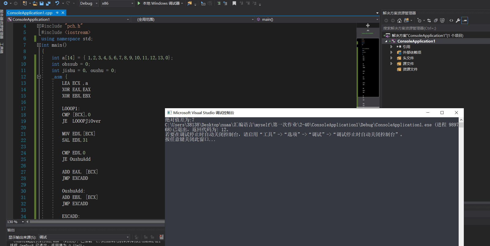

## <center>汇编作业（一）</center>
### <center>161730123-刘志赞</center>
#### <center>2019.10.3</center>
#### 1、P58,40题，计算奇数之和偶数之和的差的绝对值
##### 思路：
判断是否结尾 ECX用来迭代 然后每次判断是否为基数偶数 左移31位，然后和0无符号比较 等于就是偶数 不等于就是基数可以直接加 得到两个值EAX EBX 判断大小后减法即可
##### 代码：
```c
#include "pch.h"
#include <iostream>
using namespace std;
int main()
{
	int a[14] = { 1,2,3,4,5,6,7,8,9,10,11,12,13,0};
	int obssub = 0;
	int jishu = 0, oushu = 0;
	_asm {
		LEA ECX ,a
		XOR EAX,EAX
		XOR EBX,EBX

		LOOOP1:
		CMP [ECX],0
		JE  LOOOPJiOver

		MOV EDX,[ECX]
		SAL EDX,31

		CMP EDX,0
		JE OushuAdd
       
		ADD EAX, [ECX]
        JMP EXCADD

		OushuAdd:
		ADD EBX, [ECX]
		JMP EXCADD

		EXCADD:
		ADD ECX,4
		JMP LOOOP1

		LOOOPJiOver:
		CMP EAX,EBX
		JAE EAXBIG

	    SUB EBX,EAX
		MOV EAX,EBX

		EAXBIG:
		SUB EAX,EBX

		IBSOVER:
		MOV obssub, EAX

	}
	printf("绝对值差为:%d",obssub);
}


```
##### 运行结果：
