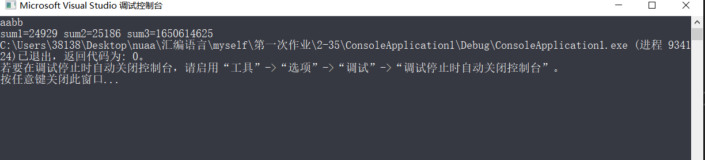

## <center>汇编作业（一）</center>
### <center>161730123-刘志赞</center>
#### <center>2019.10.3</center>

## 目录

[TOC]

#### 1、P58,35题
输入四个字符输出两个字数据的值和一个双字数字的值
##### 思路
简单的寄存器使用即可，为了得到双字数据，先将AX左移16位，然后把BX传送到AX,这样得到的EAX便是双字节数据.
注意是小端法
##### 代码
```c
#include "pch.h"
#include <stdio.h>

int main()
{
	char a, b, c, d;
	unsigned short e, f;
	unsigned int g;
	scanf("%c %c %c %c", &a, &b,&c,&d);
	_asm {
		MOV AH, b
		MOV AL,a
		MOV e,AX
		MOV BH,d
		MOV BL,c
		MOV f,BX

		SAL EBX,16
		MOV BX,AX
		MOV g, EBX
	}
	//printf("sum1=%d", e);
	printf("sum1=%d sum2=%d sum3=%d", e,f,g);
	return 0;
}
```
##### 运行结果：


#### 2、P58,38题
20个数据求连续多少个正字数据，多少个正双字数据
##### 思路
通过循环即可
##### 代码
```c

#include "pch.h"
#include <iostream>

int main()
{
	char s[21] = { 140,140,'a','a','a','a','a','a','a','a','a','a','a','a','a','a','a','a','a','a',0 };
	int word_num = 0, douword_num = 0;
	_asm {
		XOR EAX,EAX
		LEA EBX,s
		XOR ECX,ECX
		XOR EDX,EDX
		LOOOP:
			CMP [EBX],0
			JE LOOOPMOVTEN
            
			MOV CX,[EBX]
			CMP CX,0
            JLE INCRIG
			INC EAX

		INCRIG:
			INC EBX
			INC EBX
			JMP LOOOP

		LOOOPMOVTEN:
			MOV word_num,EAX

		XOR EAX, EAX
		LEA EBX, s
		XOR ECX, ECX
		XOR EDX, EDX
		LOOOP1:
			CMP [EBX], 0
			JE LOOOPMOVFIVE
			MOV ECX, [EBX]
			CMP ECX, 0
			JLE INCDOURIG 
			INC EAX

		INCDOURIG:
			INC EBX
			INC EBX
			INC EBX
			INC EBX
			JMP LOOOP1

		LOOOPMOVFIVE:
			MOV douword_num, EAX


	}
	printf("十个字数据整数中正数有%d个，五个双字数据整数中正数有%d个",word_num,douword_num);
	return 0;
}

```
##### 运行结果：

#### 3、P58,40题
计算奇数之和偶数之和的差的绝对值
##### 思路
判断是否结尾 ECX用来迭代 然后每次判断是否为基数偶数 左移31位，然后和0无符号比较 等于就是偶数 不等于就是基数可以直接加 得到两个值EAX EBX 判断大小后减法即可
##### 代码
```c
#include "pch.h"
#include <iostream>
using namespace std;
int main()
{
	int a[14] = { 1,2,3,4,5,6,7,8,9,10,11,12,13,0};
	int obssub = 0;
	int jishu = 0, oushu = 0;
	_asm {
		LEA ECX ,a
		XOR EAX,EAX
		XOR EBX,EBX

		LOOOP1:
		CMP [ECX],0
		JE  LOOOPJiOver

		MOV EDX,[ECX]
		SAL EDX,31

		CMP EDX,0
		JE OushuAdd
       
		ADD EAX, [ECX]
        JMP EXCADD

		OushuAdd:
		ADD EBX, [ECX]
		JMP EXCADD

		EXCADD:
		ADD ECX,4
		JMP LOOOP1

		LOOOPJiOver:
		CMP EAX,EBX
		JAE EAXBIG

	    SUB EBX,EAX
		MOV EAX,EBX

		EAXBIG:
		SUB EAX,EBX

		IBSOVER:
		MOV obssub, EAX

	}
	printf("绝对值差为:%d",obssub);
}


```
##### 运行结果：


#### 4、P128,38题
统计字符类型的个数
##### 思路
通过指针往下迭代，一个个匹配即可
##### 代码
```c++
#include "pch.h"
#include <iostream>

int main()
{
	char string1[255];
	int char_count = 0;
	int num_count = 0;
	int other_count = 0;
	scanf("%s", string1);
	_asm {
		lea eax, string1
		mov ebx, 0 // char_count
		mov ecx, 0 // num_count
		mov edx, 0 // other_count
		mov esi, 0 // i
		FOR1:
		cmp[eax + esi], 0
			je OVER
			// 小写字母
			cmp[eax + esi], 'a'
			jb NO_SM_CH
			cmp[eax + esi], 'z'
			ja NO_SM_CH
			inc ebx
			jmp FOR1_END
			NO_SM_CH :
		// 大写字母
		cmp[eax + esi], 'A'
			jb NO_BIG_CH
			cmp[eax + esi], 'Z'
			ja NO_BIG_CH
			inc ebx
			jmp FOR1_END
			NO_BIG_CH :
		// 数字
		cmp[eax + esi], '0'
			jb NO_NUM_CH
			cmp[eax + esi], '9'
			ja NO_NUM_CH
			inc ecx
			jmp FOR1_END
			NO_NUM_CH :
		// 其它
		inc edx
			FOR1_END :
		inc esi
			jmp FOR1
			OVER :
		mov char_count, ebx
			mov num_count, ecx
			mov other_count, edx
	}
	printf("char_count:%d, num_count:%d, other_count:%d\n", char_count, num_count, other_count);
}
```
##### 截图


#### 5、P128,42题
整数转字符串要求用子函数
##### 思路
子函数按照书上定义写即可，由于汇编是逐渐往下运行，所以要先printf，然后return0
##### 代码
```c++
#include "pch.h"
#include <iostream>
int main()
{
	int data = 0;
	char str1[256];
	scanf("%d", &data);
	_asm {
		lea eax, data
		mov eax, [data] // 整型数
		lea ebx, str1 // 字符串位置
		push ebx
		push eax
		call FUNCTION
		pop ebx
		pop eax
	}
	printf("%s\n", str1);
	return 0;
	_asm {
	FUNCTION:
		push ebp
			mov ebp, esp
			mov eax, [ebp + 8] // 整型数
			mov ebx, [ebp + 12] // 字符串位置
			mov ecx, 0 // 十进制数的长度
			mov edi, 10
			FOR1:
		cmp eax, 0
			je NEXT1
			mov edx, 0
			div edi // EDX:EAX / edi，商放在EAX，余数放在EDX
			add dl, '0'
			mov[ebx + ecx], dl
			inc ecx
			jmp FOR1

			NEXT1 :
		mov[ebx + ecx], 0
			mov eax, ecx
			mov edx, 0
			mov edi, 2
			div edi 
			mov esi, eax
			dec esi
			dec ecx
			FOR2 :
		cmp esi, 0
			jl RET1
			mov edi, ecx // 保存ecx
			sub ecx, esi
			mov dl, [ebx + ecx]
			mov al, [ebx + esi]
			mov[ebx + esi], dl
			mov ecx, edi
			sub ecx, esi
			mov[ebx + ecx], al
			mov ecx, edi 
			dec esi
			jmp FOR2
			RET1 :
		pop ebp
			ret
	}
}
```
##### 截图

#### 6、P128,46题
计算元音字母个数然后八进制输出结果
##### 思路
八进制转换使用子程序，将10进制转8进制，然后8进制转字符串
##### 代码
```c++
#include "pch.h"
#include <iostream>

int main()
{
		const char source_chs[11] = { "AEIOUaeiou" };
		char str1[256];
		char res[256];
		scanf("%s", str1);
		_asm {
			lea ebx, str1 
			mov edi, 0 
			FOR1:
			cmp[ebx], 0
				je FOR1_END
				lea ecx, source_chs 
				FOR2 :
			cmp[ecx], 0
				je FOR2_END
				mov al, [ecx]
				cmp al, [ebx]
				jne NO_FIND
				inc edi
				jmp FOR2_END
				NO_FIND :
			inc ecx
				jmp FOR2
				FOR2_END :
			inc ebx
				jmp FOR1
				FOR1_END :

			lea eax, res
				push eax
				push edi
				call DEC2OCTSTR
				pop esi
				pop esi
		}
		printf("八进制: O%s\n", res);
		system("pause");
		return 0;
		_asm {
		DEC2OCTSTR:
			push ebp
				mov ebp, esp
				mov ebx, [ebp + 8]
				mov ecx, [ebp + 12] 

				push ebx
				call OCT_LEN 
				pop ebx

				mov[ecx + eax], 0
				dec eax

				mov ebx, [ebp + 8] 
				FOR3:
			cmp ebx, 0
				je FOR3_END
				mov edx, ebx
				and ebx, 111B 

				add bl, '0'
				mov[ecx + eax], bl

				shr edx, 3
				mov ebx, edx
				dec eax
				jmp FOR3
				FOR3_END :
			pop ebp
				ret
		}
		_asm {
		OCT_LEN:
			push ebp
				mov ebp, esp
				mov ebx, [ebp + 8] // 第一个参数，即十进制数
				mov eax, 0 // 返回八进制数的长度
				FOR4 :
				cmp ebx, 0
				je FOR4_END
				shr ebx, 3
				inc eax
				jmp FOR4
				FOR4_END :
			pop ebp
				ret
		}
}
```
##### 截图


#### 7、P128,50题
两个自然数的和，差，积
##### 思路
也是采用子程序和输出字符串格式
##### 代码
```c++

#include "pch.h"
#include <iostream>

int main()
{
	int a, b;
	char sum[50], sub[50], mul[50];
	scanf("%d%d", &a, &b);
	_asm {
		lea esi, sum
		push esi // 第二个参数
		mov edi, a
		mov esi, b
		add edi, esi
		push edi // 第一个参数
		call DEC2STR
		pop edi
		pop edi

		lea esi, sub
		push esi
		mov edi, a
		mov esi, b
		sub edi, esi
		push edi
		call DEC2STR
		pop edi
		pop edi

		lea esi, mul
		push esi
		mov eax, a
		mov edi, b
		mov edx, 0
		mul edi
		push eax
		call DEC2STR
		pop edi
		pop edi
	}
	printf("sum:%s, sub:%s, mul:%s\n", sum, sub, mul);
	system("pause");
	return 0;
	_asm {	
	DEC2STR:
		push ebp
			mov ebp, esp
			mov ebx, [ebp + 8] 
			mov ecx, [ebp + 12] 
			push ebx
			call DEC_LEN 
			pop ebx
			mov[ecx + eax], 0
			dec eax
			mov esi, eax 
			mov eax, [ebp + 8] // 十进制数
			mov edi, 10 // 除数
			FOR2:
		cmp eax, 0
			jle FOR2_END
			mov edx, 0
			div edi 
			add edx, '0'
			mov[ecx + esi], dl 
			dec esi
			jmp FOR2
			FOR2_END :
		pop ebp
			ret
	}
	_asm {
	DEC_LEN:
		push ebp
			mov ebp, esp
			mov eax, [ebp + 8] // 十进制数
			mov ebx, 0 // 十进制数长度
			mov edi, 10 // 除数
			FOR1 :
			cmp eax, 0
			jle FOR1_END
			mov edx, 0
			div edi // EDX:EAX / EDI
			inc ebx
			jmp FOR1
			FOR1_END :
		mov eax, ebx
			pop ebp
			ret
	}
}
```
##### 截图

#### 8、P128,52题
把字符串中的十进制数作为数据值，计算出和
##### 思路
其实耶不是很多，就是跳来跳去，最后计算出总数
##### 代码
```c++

#include "pch.h"
#include <iostream>

int main()
{
	char str[100]; // A123We56st002345
	int sum = 0;
	scanf("%s", str);
	_asm {
		lea esi, sum 
		lea ebx, str
		FOR1 :
		cmp[ebx], 0
		je FOR1_END
		mov eax, 0 
		cmp[ebx], '1'
		jl NO_NUM
		cmp[ebx], '9'
		jg NO_NUM
		FOR2 :
		mov ecx, 0 
		cmp[ebx], '0'
		jl NO_NUM
		cmp[ebx], '9'
		jg NO_NUM
		mov cl, [ebx]
		sub ecx, '0'
		mov edx, 0
		mov edi, 10
		mul edi 
		add eax, ecx
		inc ebx
		jmp FOR2
		NO_NUM :
		add[esi], eax
		inc ebx
		jmp FOR1
		FOR1_END :
	}
	printf("%d\n", sum);
	return 0;
}

```
