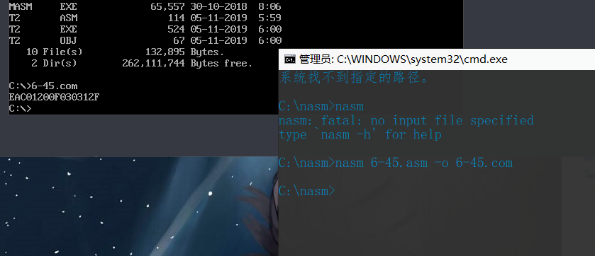
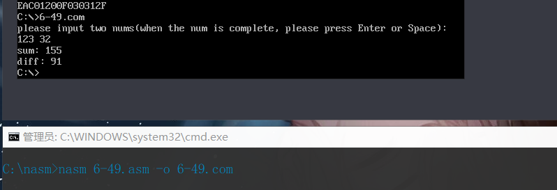
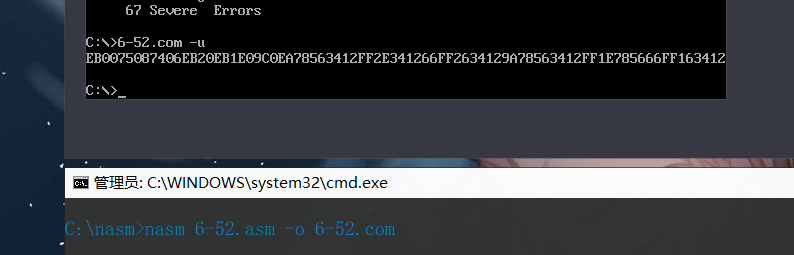

## <center>汇编作业（三）</center>
### <center>161730123-刘志赞</center>
#### <center>2019.11.6</center>

## 目录

[TOC]

### 1、 **P270-45:****以十六进制形式输出****0FFFF0H****开始的****8****个字节**

#### 1.1、思路
采用 [段值:段内偏移] 的形式进行访问
#### 1.2、代码
```asm
;---- code segement ----
    section code
start:
    org 100H ; 
    mov ax, 0F000H
    mov es, ax
    mov bx, 0FFF0H ; es:bx = 0FFFF0H
    mov di, 0
function1:
    cmp di, 8
    je over_function1
    mov al, BYTE [es:bx+di]
    shr al, 4
    call toHexAscii_func ; 
    call print_Char

    mov al, BYTE [es:bx+di]
    and al, 0FH
    call toHexAscii_func ; 
    call print_Char

    inc di
    jmp function1
over_function1:
    ; mov [param1], bp
    ; mov WORD [param2], 8
    ; call printStr
    mov ah, 4CH
    int 21H ; 

toHexAscii_func:
    cmp al, 9
    ja toHexAscii_func_aboveNine
    add al, '0'
    jmp toHexAscii_func_return
toHexAscii_func_aboveNine:
    sub al, 10
    add al, 'A'
toHexAscii_func_return:
    ret
print_Char:
    mov dl, al ; 待显示的字符
    mov ah, 2
    int 21H ; 显示该字符
    ret

```

#### 1.3效果

### 2、 P270-49:输入两个十进制数，计算并输出这两个数的和与差

#### 2.1、思路
分小函数写，分别有获取底层数据，十位数，然后主函数调用
#### 2.2、代码
```asm
; 程序描述：接收用户从键盘输入的两个十进制整数，然后计算并输出这两个数的和与差

%define SPACE 20H ; 空格
%define ENTER 0DH ; 回车

;---- code segment ----
    section code
    org 100H
start:


    mov dx, prompt
    call printStr ; 打印提示信息
    call getDec
    mov [a], ax
    call getDec
    mov [b], ax
    ; prompt sum
    mov dx, sumStr
    call printStr
    ; 求和
    mov ax, [a]
    add ax, [b]
    call printDec_to_up
    ; 换行
    mov dx, newline
    call printStr
    ; prompt diff
    mov dx, diffStr
    call printStr
    ; 求差
    mov ax, [a]
    cmp ax, [b]
    jle b_sub_a
    sub ax, [b]
    call printDec_to_up
    jmp over
b_sub_a:
    mov ax, [b]
    sub ax, [a]
    call printDec_to_up
over:
    mov ah, 4CH
    int 21H ; 返回操作系统


printDec_to_up:
    push bx
    mov si, 0 ; 十进制数的位数

printDec_to_up_function1:
    cmp ax, 0
    je printDec_to_up_for2
    mov dx, 0
    mov di, 10
    div di ; (dx:ax)/10 = ax...dx
    push dx ; 
    add si, 1 ; 
    jmp printDec_to_up_function1

printDec_to_up_for2:
    cmp si, 0
    je printDec_to_up_return
    pop dx
    add dl, '0'
    call putOutChar
    dec si
    jmp printDec_to_up_for2
printDec_to_up_return:
    pop bx
    ret

getDec:
    push bx
    mov bx, 0 ; sum，最终数
    mov ax, 0
getDec_for1:
    call getChar
    ; 遇到回车
    cmp al, ENTER
    je getDec_return
    ; 遇到空格
    cmp al, SPACE
    je getDec_return
    sub al, '0'
    imul bx, 10 ; sum = sum*10 + num
    mov ah, 0
    add bx, ax
    jmp getDec_for1
getDec_return:
    mov ax, bx
    pop bx
    ret

printStr:
    ; mov ah, 9
    ; int 21H
    ; ret
    push bx
    mov bx, dx
printStr_for1:
    mov dl, [bx]
    cmp dl, '$'
    je printStr_return
    call putOutChar
    inc bx
    jmp printStr_for1
printStr_return:
    pop bx
    ret


putOutChar:
    mov ah, 2
    int 21H ; 显示该字符
    ret

getChar:
    mov ah, 1
    int 21H ; 从键盘读取字符保存到al中
    ret


;---- data segment ----
    section data
prompt  db "please input two nums(when the num is complete, please press Enter or Space):", 0DH, 0AH, '$'
a       dw 0
b       dw 0
sum     dw 0
diff    dw 0
sumStr  db "sum: ", '$'
diffStr db "diff: ", '$'
newline db 0DH, 0AH, '$'

```
#### 2.3、效果

### 3、 P271-52:以十六进制形式显示指令的机器码
#### 3.1、思路
先获取待显示指令的首地址，依次以十
六进制形式输出其机器码。
#### 3.2、代码
```asm
; 程序描述：以十六进制形式显示对应指令的机器码

;---- code segment ----
    section code
    org 100H ; 不加时输出会乱码
start:

    mov di, target
for1:
    cmp di, ok
    je over_function
    mov al, BYTE [di]
    shr al, 4
    call print_toHexAscii
    call putChar
    mov al, BYTE [di]
    and al, 0FH
    call print_toHexAscii
    call putChar
    inc di
    jmp for1
over_function:
    mov ah, 4CH
    int 21H ;
target:
    jmp short $+2
    jnz next
    jz next
    jmp ok
    jmp short ok
    or ax, ax
next:
    jmp 1234H:5678H
    jmp far [1234H]
    jmp dword [1234H]
    call 1234H:5678H
    call far [5678H]
    call dword [1234H]
ok:
print_toHexAscii:
    and al, 0FH
    cmp al, 9
    ja print_toHexAscii_aboveNine
    add al, '0'
    jmp print_toHexAscii_return
print_toHexAscii_aboveNine:
    sub al, 10
    add al, 'A'
print_toHexAscii_return:
    mov dl, al
    ret
printStr:
    push bx
    mov bx, dx
printStr_for1:
    mov dl, [bx]
    cmp dl, '$'
    je printStr_return
    call putChar
    inc bx
    jmp printStr_for1
printStr_return:
    pop bx
    ret
putChar:
    mov ah, 2
    int 21H ; 显示该字符
    ret
getChar:
    mov ah, 1
    int 21H ; 从键盘读取字符保存到al中
    ret
;---- data segment ----
    section data

```
#### 3.3、效果
