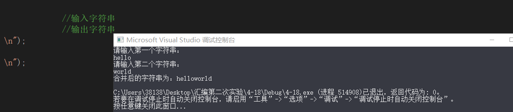
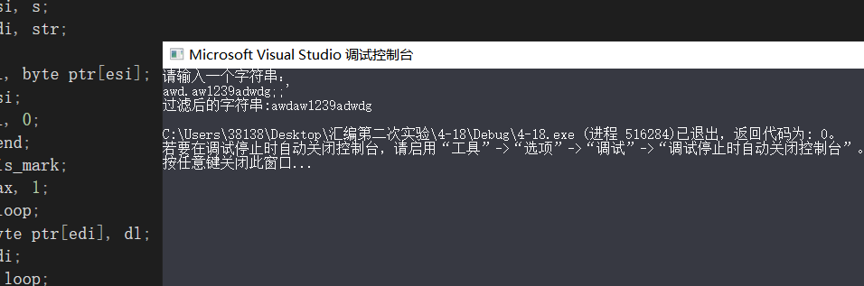
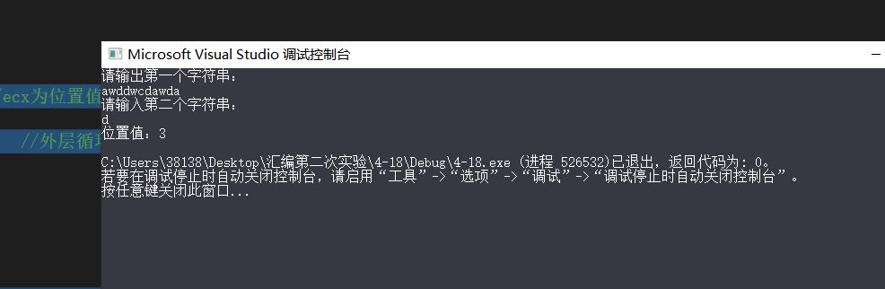
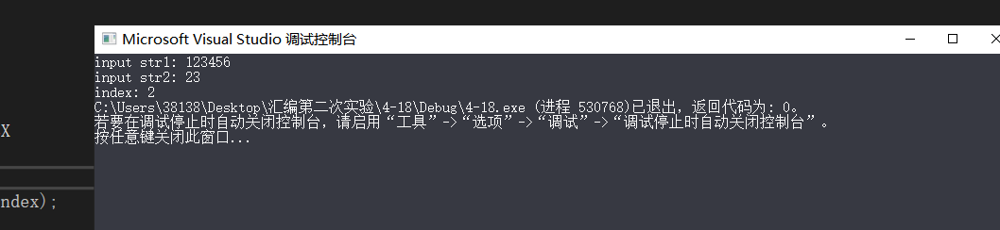
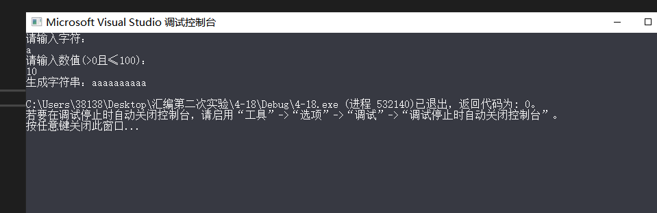
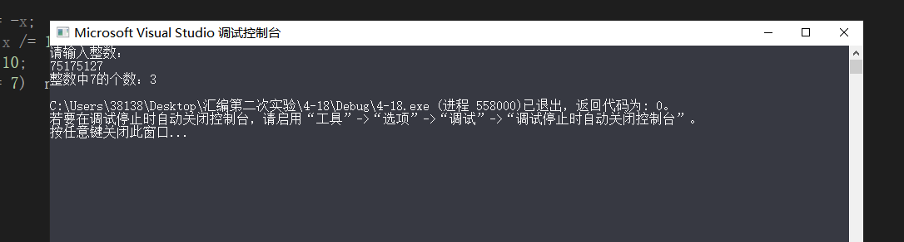
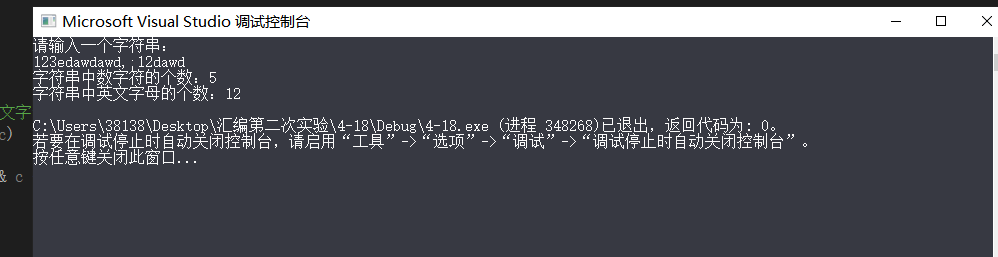
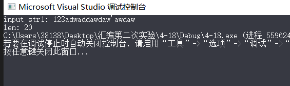
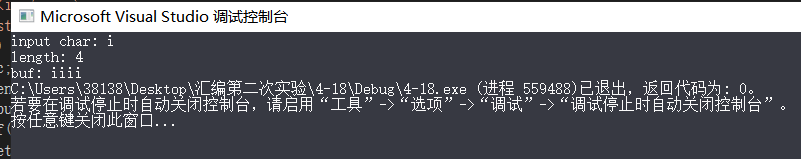

###  <center>汇编作业（二）</center>
### <center>161730123-刘志赞</center>
#### <center>2019.10.16</center>

## 目录

[TOC]

### 1、P153,18题-两个字符串拼接起来
#### 思路
根据地址依次读取两个字符串中的字符然后放入目标字符串中即可
#### 代码
```c

#include "pch.h"
#include <iostream>

int main()
{
	char string1[100], string2[100];                   //输入字符串
	char s[200];                             //输出字符串
	printf("请输入第一个字符串：\n");
	scanf("%s", string1);
	printf("请输入第二个字符串：\n");
	scanf("%s", string2);
	_asm {
		lea ebx, s;
		lea esi, string1;
		lea edi, string2;
	lea_char_1:                                 //在目标字符串上存第一个字符串
		mov al, byte ptr[esi];
		inc esi;
		cmp al, 0;
		je lea_char_2;
		mov byte ptr[ebx], al;
		inc ebx;
		jmp lea_char_1;
	lea_char_2:                                 //在目标字符串上存第二个字符串
		mov al, byte ptr[edi];
		inc edi;
		cmp al, 0;
		je lab_3;
		mov byte ptr[ebx], al;
		inc ebx;
		jmp lea_char_2;
	lab_3:
		mov byte ptr[ebx], 0;
	}
	printf("合并后的字符串为：%s\n", s);
	return 0;
}
```
#### 截图


### 2、P153.19输入字符串过滤掉其中的标点符号并输出
#### 思路
循环判断原字符串中的字符是否是标点符号，若不是即可将其添加到目标字符串中。判断字符是否是标点符号采用子程序实现，依次判断该字符是否是数字、字母即可实现
#### 代码
```c
#include "pch.h"
#include <iostream>
#include<stdio.h>

int main()
{
	char s[100];                         //输入字符串
	char string1[100];                       //过滤后的字符串
	printf("请输入一个字符串：\n");
	scanf("%s", s);
	_asm {
		lea esi, s;
		lea edi, string1;
	s_loop:
		mov dl, byte ptr[esi];
		inc esi;
		cmp dl, 0;
		je s_end;
		call charge_chr;
		cmp eax, 1;
		je s_loop;
		mov byte ptr[edi], dl;
		inc edi;
		jmp s_loop;
	s_end:
		mov byte ptr[edi], 0;
		jmp OK;
	charge_chr:
		xor eax, eax;
		inc eax;              //初始化eax
		cmp dl, 30h;          //判断字符是否是数字字符
		jb lab_end;
		cmp dl, 39h;
		ja lab_1;
		dec eax;
		jmp lab_end;
	lab_1:                        //判断字符是否是大写字母
		cmp dl, 41h;
		jb lab_end;
		cmp dl, 5ah;
		ja lab_2;
		dec eax;
		jmp lab_end;
	lab_2:                        //判断字符是否是小写字母
		cmp dl, 61h;
		jb lab_end;
		cmp dl, 7ah;
		ja lab_end
			dec eax;
	lab_end:
		ret;
	}
OK:
	printf("过滤后的字符串:%s\n", string1);
	return 0;
}
```
#### 截图


### 3、P153.20输入两个字符串str1和str2，在字符串str1中查找确定首个同时出现在str2中字符的位置，如果未出现，则设位置值为-1。显示输出位置值。
#### 思路
实现查找位置值使用两层循环，外层通过对esi地址值的递增可以实现对str1的扫描，内层通过对edi地址值的递增实现对str2的扫描，当出现相同字符时跳出循环即可实现。
#### 代码
```c

#include "pch.h"
#include <iostream>
#include<stdio.h>

int main()
{
	char string1[100], string2[100];               //输入字符串
	int location;                            //位置值
	printf("请输出第一个字符串：\n");
	scanf("%s", string1);
	printf("请输入第二个字符串：\n");
	scanf("%s", string2);
	_asm {
		xor ecx, ecx;
		dec ecx;                             //ecx为位置值
		lea esi, string1;
	out_loop:		                             //外层循环扫描string1
		mov al, byte ptr[esi];
		inc ecx;
		inc esi;
		cmp al, 0;
		je no_init;
		lea edi, string2;
	in_loop:                                     //内层循环扫描string2
		mov dl, byte ptr[edi];
		inc edi;
		cmp dl, 0;
		je out_loop;
		cmp dl, al;
		je yes_init;
		jmp in_loop;
	no_init:                                        //未出现
		xor ecx, ecx;
		dec ecx;
		lea ebx, location;
		mov[ebx], ecx;
	yes_init:                                       //出现
		lea ebx, location;
		mov[ebx], ecx;
	}
	printf("位置值：%d\n", location+1);
	return 0;
}
```
#### 截图

### 4、P153.21输入两个字符串str1和str2，然后查找确定str2在str1中出现的起始位置
#### 思路
这道题的思路与上一道题相似，如果在内循环中出现了相同的字符，则继续扫描两个字符串直至str2结束，若在这整个过程中字符都相同，则返回str1位置值即可；否则进入外层循环继续扫描str1.
#### 代码
```c
#include "pch.h"
#include <iostream>
#include<stdio.h>
int main() {
	char str1[100];
	char str2[100];
	int index = -1;
	printf("input str1: ");
	scanf("%s", str1);
	printf("input str2: ");
	scanf("%s", str2);
	_asm {
		LEA ESI, str1
		LEA EDI, str2
		XOR EAX, EAX
		CALL myStrlen
		MOV EBX, ECX
		L5 :
		CMP[ESI], 0
			JZ  L0
			LODSW
			REPNZ SCASB
			JZ  L4
			LEA EDI, str2
			MOV ECX, EBX
			JMP L5

			myStrlen :
		XOR ECX, ECX
			L2 :
		CMP[EDI + ECX], 0
			JZ  L1
			INC ECX
			JMP L2

			L1 :
		RET


			L0 :
		MOV index, -1
			JMP L3
			L4 :
		SUB EBX, ECX
			MOV index, EBX
			L3 :
	}
	printf("index: %d", index);

	return 0;
}
```
#### 截图

### 5、P154.22输入一个字符ch和一个数值n，然后生成由字符ch构成的n个字符的字符串并输出。
#### 思路
输入的n给计算器，每次计数器减一，字符串增加一个长度即可
#### 代码
```c
#include "pch.h"
#include <iostream>
#include<stdio.h>
int main()
{
	char c;                             //输入字符
	int n;                              //输入数值
	char tar_str[100];                      //目标字符串
	printf("请输入字符：\n");
	scanf("%c", &c);
	printf("请输入数值(>0且≤100)：\n");
	scanf("%d", &n);
	_asm {
		mov al, c;
		lea edi, tar_str;
		mov ecx, n;
		call str_grow;
		jmp END_OK;
	str_grow:
		cld;                              //清方向标志，DF=0，地址从高到低
	s_loop:
		stosb;
		dec ecx;
		cmp ecx, 0;
		jne s_loop;
		mov byte ptr[edi], 0;
		ret;
	}
END_OK:
	printf("生成字符串：%s\n", tar_str);
	return 0;
}
```
#### 截图


### 6、P218.1输入十进制整数，统计其各位中7出现的次数并输出
#### 思路
由低到高判断即可
#### 代码
```c
#include<stdio.h>

//求整数中7的个数
int num_7(int x)
{
	int n = 0;
	int temp = 0;
	if(x < 0)  x = -x;
	for( ;x != 0; x /= 10) {
		temp = x%10;
		if(temp == 7)  n++;
	}
	return n;
}

int main()
{
	int x;
	int num;
	printf("请输入整数：\n");
	scanf("%d", &x);
	num = num_7(x);
	printf("整数中7的个数：%d\n", num);
	return 0;
}
```
#### 截图
 
#### 分析生成的汇编
```c
	int n = 0;
00701EE8  mov         dword ptr [n],0  
	int temp = 0;
00701EEF  mov         dword ptr [temp],0  
	if (x < 0)  x = -x;
00701EF6  cmp         dword ptr [x],0  
00701EFA  jge         num_7+44h (0701F04h)  
00701EFC  mov         eax,dword ptr [x]  
00701EFF  neg         eax  
00701F01  mov         dword ptr [x],eax  
	for (; x != 0; x /= 10) {
00701F04  jmp         num_7+54h (0701F14h)  
00701F06  mov         eax,dword ptr [x]  
00701F09  cdq  
00701F0A  mov         ecx,0Ah  
00701F0F  idiv        eax,ecx  
00701F11  mov         dword ptr [x],eax  
00701F14  cmp         dword ptr [x],0  
00701F18  je          num_7+79h (0701F39h)  
		temp = x % 10;
00701F1A  mov         eax,dword ptr [x]  
00701F1D  cdq  
00701F1E  mov         ecx,0Ah  
00701F23  idiv        eax,ecx  
00701F25  mov         dword ptr [temp],edx  
		if (temp == 7)  n++;
00701F28  cmp         dword ptr [temp],7  
00701F2C  jne         num_7+77h (0701F37h)  
00701F2E  mov         eax,dword ptr [n]  
00701F31  add         eax,1  
00701F34  mov         dword ptr [n],eax  
	}
00701F37  jmp         num_7+46h (0701F06h)  
	return n;
00701F39  mov         eax,dword ptr [n]  
}
00701F3C  pop         edi  
00701F3D  pop         esi  
00701F3E  pop         ebx  
00701F3F  add         esp,0D8h  
00701F45  cmp         ebp,esp  
00701F47  call        __RTC_CheckEsp (0701276h)  
00701F4C  mov         esp,ebp  
00701F4E  pop         ebp  
00701F4F  ret  
```
### 7、2输入字符串，统计其中数字符和英文字母出现的个数并输出统计结果
#### 思路
逐步计算分析即可
#### 代码分析
```c
int main()
{
00811A50  push        ebp  
00811A51  mov         ebp,esp  
00811A53  sub         esp,64Ch  
00811A59  push        ebx  
00811A5A  push        esi  
00811A5B  push        edi  
00811A5C  lea         edi,[ebp-64Ch]  
00811A62  mov         ecx,193h  
00811A67  mov         eax,0CCCCCCCCh  
00811A6C  rep stos    dword ptr es:[edi]  
00811A6E  mov         eax,dword ptr [__security_cookie (081C004h)]  
00811A73  xor         eax,ebp  
00811A75  mov         dword ptr [ebp-4],eax  
00811A78  mov         ecx,offset _D0892308_4-18@cpp (081E008h)  
00811A7D  call        @__CheckForDebuggerJustMyCode@4 (081126Ch)  
	char str[1000];
	int num1 = 0;                                  //字符串中数字符的个数
00811A82  mov         dword ptr [num1],0  
	int num2 = 0;                                  //字符串中英文字母的个数
00811A8C  mov         dword ptr [num2],0  
	printf("请输入一个字符串：\n");
00811A96  push        offset string "\xc7\xeb\xca\xe4\xc8\xeb\xd2\xbb\xb8\xf6\xd7\xd6\xb7\xfb\xb4\xae\xa3\xba\n" (0819CF4h)  
00811A9B  call        _printf (08113F2h)  
00811AA0  add         esp,4  
	scanf("%s", str);
00811AA3  lea         eax,[str]  
00811AA9  push        eax  
00811AAA  push        offset string "%s" (0819BECh)  
00811AAF  call        _scanf (08113F7h)  
00811AB4  add         esp,8  
	get_n(str, &num1, &num2);
00811AB7  lea         eax,[num2]  
00811ABD  push        eax  
00811ABE  lea         ecx,[num1]  
00811AC4  push        ecx  
00811AC5  lea         edx,[str]  
00811ACB  push        edx  
00811ACC  call        get_n (081141Fh)  
00811AD1  add         esp,0Ch  
	printf("字符串中数字符的个数：%d\n", num1);
00811AD4  mov         eax,dword ptr [num1]  
00811ADA  push        eax  
	printf("字符串中数字符的个数：%d\n", num1);
00811ADB  push        offset string "\xd7\xd6\xb7\xfb\xb4\xae\xd6\xd0\xca\xfd\xd7\xd6\xb7\xfb\xb5\xc4\xb8\xf6\xca\xfd\xa3\xba%d\n" (0819E30h)  
00811AE0  call        _printf (08113F2h)  
00811AE5  add         esp,8  
	printf("字符串中英文字母的个数：%d\n", num2);
00811AE8  mov         eax,dword ptr [num2]  
00811AEE  push        eax  
00811AEF  push        offset string "\xd7\xd6\xb7\xfb\xb4\xae\xd6\xd0\xd3\xa2\xce\xc4\xd7\xd6\xc4\xb8\xb5\xc4\xb8\xf6\xca\xfd\xa3\xba%d\n" (0819E4Ch)  
00811AF4  call        _printf (08113F2h)  
00811AF9  add         esp,8  
	return 0;
00811AFC  xor         eax,eax  
}
00811AFE  push        edx  
00811AFF  mov         ecx,ebp  
00811B01  push        eax  
00811B02  lea         edx,ds:[811B30h]  
00811B08  call        @_RTC_CheckStackVars@8 (0811299h)  
00811B0D  pop         eax  
00811B0E  pop         edx  
00811B0F  pop         edi  
00811B10  pop         esi  
00811B11  pop         ebx  
00811B12  mov         ecx,dword ptr [ebp-4]  
00811B15  xor         ecx,ebp  
00811B17  call        @__security_check_cookie@4 (0811235h)  
00811B1C  add         esp,64Ch  
00811B22  cmp         ebp,esp  
00811B24  call        __RTC_CheckEsp (0811276h)  
00811B29  mov         esp,ebp  
00811B2B  pop         ebp  
00811B2C  ret  
00811B2D  nop         dword ptr [eax]  
00811B30  add         eax,dword ptr [eax]  
00811B32  add         byte ptr [eax],al  
00811B34  cmp         byte ptr [ebx],bl  
00811B36  add         dword ptr [eax],0FFFFFC10h  
00811B3C  call        66811B44  
00811B41  sbb         eax,dword ptr [ecx-3FC00h]  
00811B47  inc         dword ptr [eax+eax]  
00811B4A  add         byte ptr [eax],al  
00811B4C  popad  
00811B4D  sbb         eax,dword ptr [ecx-40800h]  
00811B53  inc         dword ptr [eax+eax]  
00811B56  add         byte ptr [eax],al  
00811B58  pop         esp  
00811B59  sbb         eax,dword ptr [ecx+6D756E00h]  
00811B5F  xor         al,byte ptr [eax]  
00811B61  outs        dx,byte ptr [esi]  
00811B62  jne         _main+181h (0811BD1h)  
00811B64  xor         dword ptr [eax],eax  
00811B66  jae         _main+18Ch (0811BDCh)  
00811B68  jb          _main+11Ah (0811B6Ah)  
```
#### 截图
 
### 8、实现C库函数strlen。
#### 思路
扫描字符串并计数，直到扫描到结束符为止。
#### 代码
```c
#include<stdio.h>
int main() {
	char str1[100];
	int len = 0;
	printf("input str1: ");
	scanf("%s", str1);
	_asm {
		LEA ESI, str1
		CALL myStrlen
		JMP L3

	myStrlen:
		XOR EAX, EAX
	L2:
		CMP [ESI + EAX], 0
		JZ  L1
		INC EAX
		JMP L2
	L1:
		RET

	L3:
		MOV len, EAX
	}
	printf("len: %#d", len);

	return 0;
}

```
#### 截图
 


### 9、实现C库函数memset
#### 思路
根据输入的字节数将指定设置的字节值逐字节填充到目标地址
#### 代码
```c
#include "pch.h"
#include <iostream>
#include<stdio.h>
int main() {
	char c;
	int len = 0;
	char buf[100];
	printf("input char: ");
	c = getchar();
	getchar();
	printf("length: ");
	scanf("%d", &len);
	_asm {
		LEA EDI, buf
		MOV AL, c
		MOV ECX, len
		REP STOSB
		MOV[EDI], 0
	}
	printf("buf: %s", buf);

	return 0;
}
```
#### 截图
 


### 10、实现C库函数strpbrk
#### 思路
源字符串（s1）中找出最先含有搜索字符串（s2）中任一字符的位置并返回，若找不到则返回空指针。实现就是第4-20题

#### 代码
```c

#include "pch.h"
#include <iostream>
#include<stdio.h>

int main()
{
	char string1[100], string2[100];               //输入字符串
	int location;                            //位置值
	printf("请输出第一个字符串：\n");
	scanf("%s", string1);
	printf("请输入第二个字符串：\n");
	scanf("%s", string2);
	_asm {
		xor ecx, ecx;
		dec ecx;                             //ecx为位置值
		lea esi, string1;
	out_loop:		                             //外层循环扫描string1
		mov al, byte ptr[esi];
		inc ecx;
		inc esi;
		cmp al, 0;
		je no_init;
		lea edi, string2;
	in_loop:                                     //内层循环扫描string2
		mov dl, byte ptr[edi];
		inc edi;
		cmp dl, 0;
		je out_loop;
		cmp dl, al;
		je yes_init;
		jmp in_loop;
	no_init:                                        //未出现
		xor ecx, ecx;
		dec ecx;
		lea ebx, location;
		mov[ebx], ecx;
	yes_init:                                       //出现
		lea ebx, location;
		mov[ebx], ecx;
	}
	printf("位置值：%d\n", location+1);
	return 0;
}
```
#### 截图
